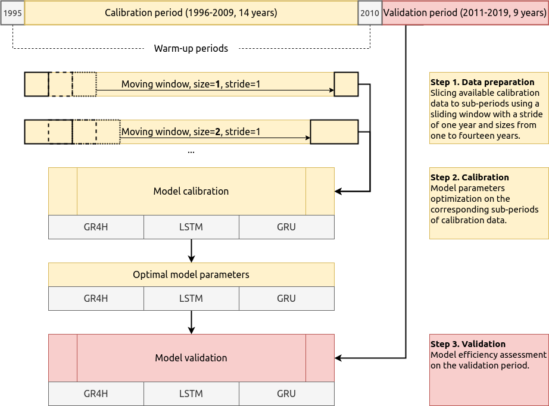

# KALIv2

## Investigating the effect of the calibration data length on the performance of hydrological models

In the present repository, you can find the materials for the paper 

> **Ayzel G., Heistermann M. The effect of calibration data length on the performance of conceptual versus data-driven hydrological models.** 

which was revised and re-submitted to [*Computers & Geosciences*](https://www.sciencedirect.com/journal/computers-and-geosciences). The initially submitted version of the paper and the corresponding repository are located [here](https://github.com/hydrogo/KALI).


### Idea and workflow

In this study, we want to investigate the effect of calibration data length on the validation performance of different rainfall-runoff models. To this aim, we consequently increase the calibration data length from one to twenty calendar years and investigate how that affects the model skill on a hold-out (validation) period. 

-----



-----

We use three models for runoff prediction at hourly temporal resolution:

> one **conceptual**

1. GR4H -- a conceptual hydrological model. It is a derivative from [the GR4J model](https://webgr.inrae.fr/en/models/daily-hydrological-model-gr4j/) -- the version for runoff prediction at daily temporal resolution.

> and two **data-driven** models which differ by the type of the computational layer used

1. Long Short-Term Memory Network (LSTM)
2. Gated Recurrent Units Network (GRU)

### Code

The code is written in [*Python*](https://docs.python.org/) programming language (v3.6) using open-source software libraries, such as [*numpy*](https://numpy.org/), [*pandas*](https://pandas.pydata.org/), [*scipy*](https://www.scipy.org/), [*numba*](http://numba.pydata.org/), [*tensorflow*](https://www.tensorflow.org/), and [*keras*](https://keras.io/). The analysis of obtained results was done also using [*jupyter notebooks*](https://jupyter.org/) and [*matplotlib*](https://matplotlib.org/) plotting library.

You can install all the required dependencies using [*conda*](https://docs.conda.io/projects/conda/en/latest/index.html) -- an open-source package management system. First, [install conda itself](https://docs.conda.io/projects/conda/en/latest/user-guide/install/index.html), then use the provided `environment.yml` file to create the isolated environment:

```bash
conda env create -f environment.yml
```

The `code` directory consists the following files:
1. `gr4h.py`

\- holds the code for the GR4H hydrological model. 

2. `gr4h_script.py`

\- describes the workflow for the main calibration/validation experiment for the GR4H model.

3. `ann_script.py`

\- describes the workflow for the main calibration/validation experiment for LSTM and GRU models.

4. `run_$model_name$_experiment.sh`

\- bash scripts that run the main calibration/validation experiment for the selected river basins.


There are three files (Jupyter notebooks) in the `analysis` directory:
1. `00_results_summary_calculation.ipynb`

\- calculates and aggregates the evaluation metrics based on obtained results of streamflow simulation [](https://doi.org/10.5281/zenodo.4013737).

2. `01_results_visualization.ipynb`

\- represents the visual analysis of the effect of calibration data length on the performance of hydrological models.

3. `02_hydrograph_plotting.ipynb`

\- consists the code for plotting hydrographs (observed and simulated runoff time series).


### Results

The full results of the conducted experiment can be found in the respective [data repository](https://doi.org/10.5281/zenodo.4013737]) [](https://doi.org/10.5281/zenodo.4013737). 

Two files aggregate evaluation metrics for the calibration and validation periods: `summary_calibration.npy` and `summary_validation.npy`, respectively. 

The `figures` subfolder consists of figures that were generated using the `01_results_visualization.ipynb` Jupyter notebook.


### Data availability

Input data (discharge and meteorological forcing time series) for the selected set of basins is located in the `forcing` directory. 

We used the following sources for the input data compilation:
1. [National Water Information System (NWIS)](https://nwis.waterdata.usgs.gov/nwis) -- to retrieve discharge time series.
2. [NLDAS reanalysis](https://disc.gsfc.nasa.gov/datasets/NLDAS_FORA0125_H_002/summary) -- to retrieve precipitation and air temperature data.
